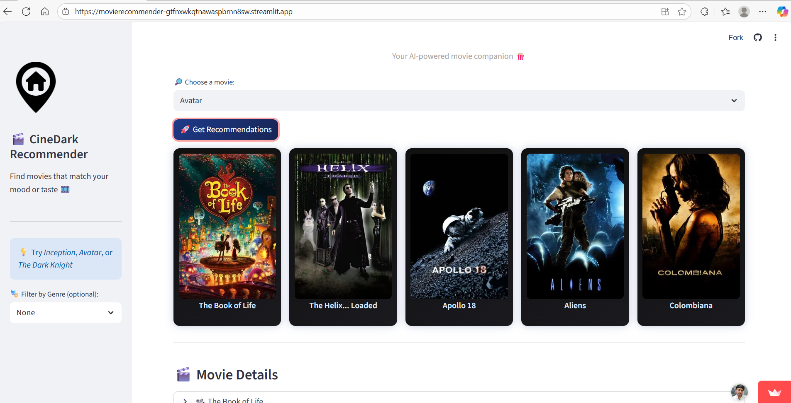

# 🎬 Movie Recommendation System

A **content-based movie recommender** built using **Machine Learning** and **Streamlit**.  
Select a movie, and the system suggests similar ones using **cosine similarity** on TMDB dataset features.

---

## 🚀 Live Demo
🔗 [Try it here!](https://movierecommender-gtfnxwkqtnawaspbrnn8sw.streamlit.app/)

---

## 🧠 Approach

1. **Data Collection**
   - Used the [TMDB dataset](https://www.themoviedb.org/) containing movie titles, genres, cast, crew, and overviews.

2. **Feature Engineering**
   - Combined multiple features such as:
     - Overview
     - Genre
     - Cast
     - Crew
   - Created a **combined feature text** for each movie.

3. **Text Vectorization**
   - Used **CountVectorizer / TF-IDF Vectorizer** to convert text into numerical feature vectors.

4. **Similarity Computation**
   - Computed pairwise **cosine similarity** between all movie vectors.
   - For a selected movie, fetched the top-N most similar movies.

5. **Frontend (Streamlit)**
   - Built an interactive UI using **Streamlit**.
   - User selects a movie → system displays similar movie recommendations.

---

## 📸 Screenshots / Demo Images

> You can upload your screenshots here once you have them (replace the file names accordingly).

| Home Page | Recommendation Results |
|------------|------------------------|
|  |  |

📍 *Place your screenshots inside an `images/` folder in your project directory.*

---

## ⚙️ Tech Stack

- 🐍 **Python**
- 📊 **Pandas**, **NumPy**
- 🤖 **Scikit-learn**
- 🌐 **Streamlit**
- 🎞️ **TMDB Dataset**

---

## 💡 Future Improvements

- Add **user-based collaborative filtering**
- Include **movie posters** directly in recommendations
- Integrate **IMDb ratings** and **trending movie APIs**

---

## 🧑‍💻 Author
**Krishanu Mishra**  
🌟 GitHub: [Your GitHub Profile Link Here]

---

## 🪄 How to Run Locally

```bash
# Clone the repository
git clone https://github.com/yourusername/movie-recommender.git

# Navigate to the project folder
cd movie-recommender

# Install dependencies
pip install -r requirements.txt

# Run the app
streamlit run app.py
